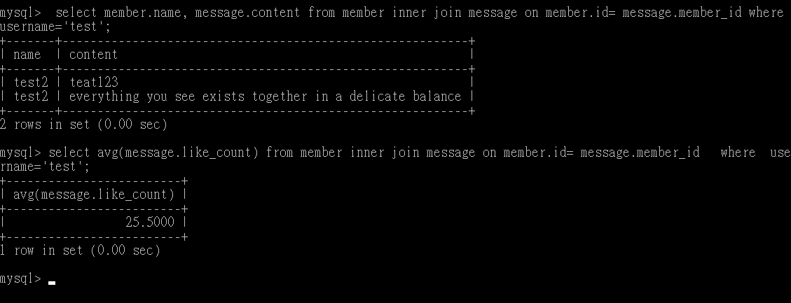

# 這個是 wehelp sql 語法系列文 ✨✨

## 要求⼆：建立資料庫和資料表

#### 建立⼀個新的資料庫，取名字為 website。

#### 在資料庫中，建立會員資料表，取名字為 member。

## 要求三：SQL CRUD

#### 使⽤ INSERT 指令新增⼀筆資料到 member 資料表中，這筆資料的 username 和 password 欄位必須是 test。接著繼續新增⾄少 4 筆隨意的資料。

#### 使⽤ SELECT 指令取得所有在 member 資料表中的會員資料。

#### 使⽤ SELECT 指令取得所有在 member 資料表中的會員資料，並按照 time 欄位，由近到遠排序。

#### 使⽤ SELECT 指令取得 member 資料表中第 2 ~ 4 共三筆資料，並按照 time 欄位，由近到遠排序。( 並非編號 2、3、4 的資料，⽽是排序後的第 2 ~ 4 筆資料 )

1.  method 1

2.  method 2

#### 使⽤ SELECT 指令取得欄位 username 是 test 的會員資料。(上)

#### 使⽤ SELECT 指令取得欄位 username 是 test、且欄位 password 也是 test 的資料。(下)

#### 使⽤ UPDATE 指令更新欄位 username 是 test 的會員資料，將資料中的 name 欄位改成 test2

## 要求四：SQL Aggregate Function

- 前面新增時用預設值，所以來藉由 update 添加數值

#### 取得 member 資料表中，總共有幾筆資料 ( 幾位會員 )。

#### 取得 member 資料表中，所有會員 follower_count 欄位的總和。

#### 取得 member 資料表中，所有會員 follower_count 欄位的平均數

### 要求五：SQL JOIN (Optional)

#### 在資料庫中，建立新資料表紀錄留⾔資訊，取名字為 message。

#### 使⽤ SELECT 搭配 JOIN 語法，取得所有留⾔，結果須包含留⾔者會員的姓名。

#### 使⽤ SELECT 搭配 JOIN 語法，取得 member 資料表中欄位 username 是 test 的所有留⾔，資料中須包含留⾔者會員的姓名。

#### 使⽤ SELECT、SQL Aggregate Functions 搭配 JOIN 語法，取得 member 資料表中欄位 username 是 test 的所有留⾔平均按讚數。

